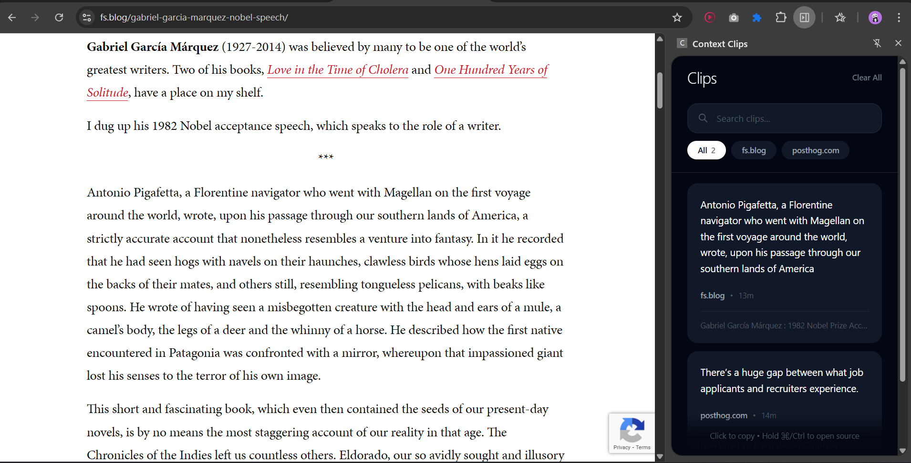

# Context Clips

A beautifully designed, context-aware clipboard manager Chrome extension inspired by Apple's minimalist design philosophy. Intelligently organizes your copied content with elegant simplicity.

## 📸 Preview



*Context Clips in action - showing the minimalist sidepanel with domain filtering, search, and captured clips from different websites.*

## ✨ Features

### Core Features
- **🎯 Smart Capture**: Automatically captures clipboard content with rich context (URL, page title, timestamp)
- **🏷️ Domain Filtering**: Filter clips by website with elegant pill buttons
- **🔍 Instant Search**: Find clips instantly across content, domains, and page titles
- **📋 One-Click Copy**: Click any clip to copy it back to your clipboard
- **🔗 Quick Access**: Cmd/Ctrl + Click to open the source page
- **🎨 Beautiful UI**: Minimalist design with light/dark mode support
- **🔒 Privacy First**: All data stored locally in your browser - no cloud, no tracking

### Design Philosophy
Inspired by Jony Ive's approach to design:
- **Extreme Simplicity**: Clean, uncluttered interface that focuses on your content
- **Intuitive Interactions**: No learning curve - actions feel natural and discoverable
- **Visual Feedback**: Smooth animations and immediate feedback for every action
- **Content First**: Your clips are the hero, the UI serves to enhance them

## 🚀 Installation

### From Source

1. Clone this repository:
   ```bash
   git clone <repository-url>
   cd contextclips
   ```

2. Install dependencies:
   ```bash
   npm install
   ```

3. Build the extension:
   ```bash
   npm run build
   ```

4. Load in Chrome:
   - Open `chrome://extensions/`
   - Enable "Developer mode"
   - Click "Load unpacked"
   - Select the `dist` folder

## 💡 Usage

### Capturing Clips

Simply copy text from any webpage using `Ctrl+C` (Windows/Linux) or `Cmd+C` (Mac). The extension automatically captures:
- The copied text content
- Source domain
- Page title
- Full URL
- Timestamp

### Finding Clips

**Search**: Type in the search bar to instantly filter clips across all fields

**Domain Filter**: Click domain pills to view clips from specific websites
- "All" shows everything
- Individual domains let you focus on specific sources
- Scroll horizontally to see all available domains

### Using Clips

**Copy to Clipboard**: Click any clip to copy its content
- Visual feedback with checkmark confirmation
- Card animates to show the copy was successful

**Open Source**: Hold Cmd (Mac) or Ctrl (Windows/Linux) and click to open the original page

**Delete**: Hover over a clip to reveal the delete button

### Accessing Clips

Click the extension icon in your toolbar to open the side panel with all your clips.

### Searching & Filtering

**Search Bar**: Type to instantly filter clips by:
- Content text
- Website domain
- Page title

**Domain Filter**: Click pills below the search bar to filter by specific websites

**Combined**: Use search + domain filter together for precise discovery

**Clear Search**: Click the ✕ button in the search field

## 🛠️ Development

### Prerequisites

- Node.js 16+ and npm
- Chrome browser

### Development Mode

Run the development server with hot reload:

```bash
npm run dev
```

Then load the extension in Chrome as described in the Installation section.

### Build for Production

```bash
npm run build
```

### Type Checking

```bash
npm run type-check
```

## 📁 Project Structure

```
contextclips/
├── src/
│   ├── background/
│   │   └── service-worker.ts      # Background service worker
│   ├── content/
│   │   └── content-script.ts      # Content script for capture
│   ├── sidepanel/
│   │   ├── components/            # React components
│   │   ├── App.tsx                # Main app component
│   │   ├── main.tsx               # Entry point
│   │   ├── index.html             # HTML template
│   │   └── index.css              # Styles
│   └── types/
│       └── index.ts               # TypeScript types
├── public/
│   └── icons/                     # Extension icons
├── manifest.json                  # Extension manifest
├── vite.config.ts                 # Vite configuration
├── tailwind.config.js             # Tailwind CSS config
└── tsconfig.json                  # TypeScript config
```

## 🏗️ Architecture

- **Manifest V3**: Modern Chrome extension architecture
- **React 18**: UI framework with TypeScript
- **Vite**: Fast build tool with HMR
- **Tailwind CSS**: Utility-first CSS framework
- **Chrome Storage API**: Local data persistence
- **TypeScript**: Full type safety

## 🔒 Privacy & Security

- ✅ All data stored locally in your browser
- ✅ No external API calls
- ✅ No data collection or tracking
- ✅ No analytics
- ✅ Open source and auditable
- ✅ No permissions beyond clipboard and storage

## 🤝 Contributing

Contributions are welcome! Please feel free to submit a Pull Request.

## 📄 License

MIT License - see LICENSE file for details

## 🐛 Known Issues

None at the moment. Please report issues on the GitHub repository.

## 🗺️ Roadmap

- [ ] Export/import clips
- [ ] Custom keyboard shortcuts
- [ ] Rich content support (images, links)
- [ ] Categories and tags
- [ ] Sync across devices (optional)
- [ ] Dark/light theme toggle

## 💬 Support

For bugs, questions, or feature requests, please open an issue on GitHub.